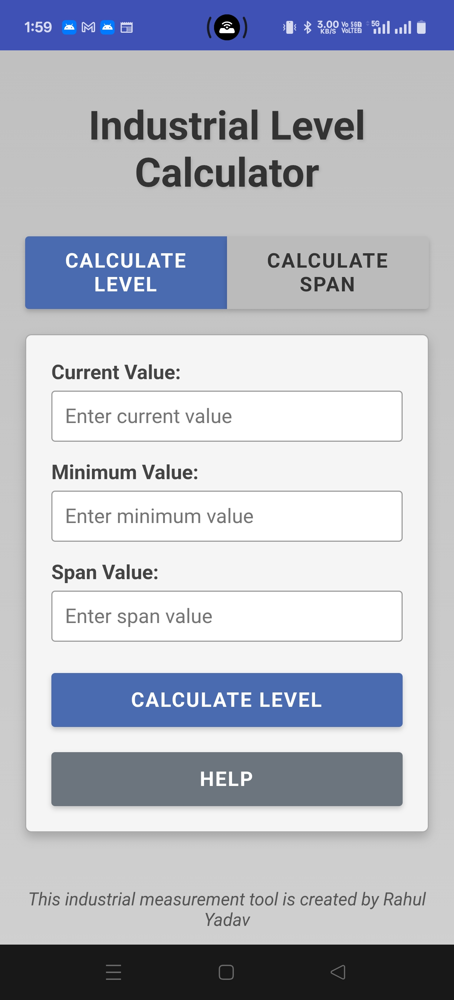

# Industrial Level Calculator

 <!-- Add a screenshot later -->

A web-based calculator for industrial measurements that calculates level percentage and span between values. Designed for process control engineers and technicians.

## Features

- **Two Calculation Modes**:
  - **Level Calculation**: Computes percentage level from current, minimum, and span values
  - **Span Calculation**: Calculates range between minimum and maximum values
- **Automatic Value Synchronization**:
  - Minimum values stay synchronized between modes
  - Calculated span automatically updates in Level mode
- **Responsive Design**: Works on desktop and mobile devices
- **Interactive Help**: Detailed instructions with formula tooltips

## Usage

### Level Calculation Mode
1. Enter the current measurement value
2. Enter the minimum expected value
3. Enter the span (or calculate it in Span mode)
4. Click "Calculate Level" to get the percentage result

### Span Calculation Mode
1. Enter the minimum value
2. Enter the maximum value
3. Click "Calculate Span" to get the range difference

## Technical Details

- **Frontend**: Pure HTML, CSS, and JavaScript (no frameworks)
- **Formulas**:
  - Level: `((Current - Minimum) / Span) × 100`
  - Span: `Maximum - Minimum`
- **Compatibility**: Works in all modern browsers

## Installation

No installation required - just open `index.html` in any web browser.

Alternatively, you can host it on any web server:

1. Clone the repository:
   ```bash
   git clone https://github.com/your-username/industrial-level-calculator.git
